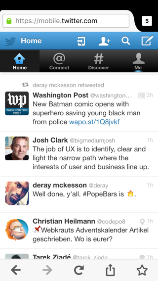

<!-- {{{ Intro -->

```javascript
function hello() {
  // Please sit where you can read this
  console.log("Hello, PyCon!");
}
```

***

# The New<br>Mobile Web

___

## Dan Callahan

## dcallahan@mozilla.com

***

 <!-- .element: style="max-width: 50%" -->

***

## URLs are Universal

<!-- }}} -->

---

<!-- {{{ Mobile Advantages -->

# Why Apps Won

***

1. Installable
2. Reliable (Works Offline)
3. Engaging (Notifications)

***

## In 2016, that changes

<!-- }}} -->

---

<!-- {{{ Installation -->

# Installation

***

<!-- .slide: data-background="black" -->

 <!-- .element: style="max-width: 50%" -->

***

<!-- .slide: data-background="black" -->

 <!-- .element: style="max-width: 50%" -->

***

<!-- .slide: data-background="black" -->

 <!-- .element: style="max-width: 50%" -->

***

## App Manifests

***

```html
<link rel="manifest" src="/manifest.json">
```

```javascript
{
  "name": "Flipkart Lite",
  "short_name": "Flipkart Lite",
  "icons": [{
    "src": "https://img1a.flixcart.com/logo.png",
    "sizes": "192x192", "type": "image/png"
  }],
  "start_url": "/",
  "orientation": "portrait",
  "display": "standalone",
  "theme_color": "#006cb4",
  "background_color": "#006cb4"
}
```

***

<!-- .slide: data-background="black" -->

<video controls class="stretch" src="img/flipkart.mp4"></video>

<!-- }}} -->

---

<!-- {{{ ES2015 Syntax + Promises -->

# Before we go on...

## A note on new JavaScript features

***

## Arrow Functions

```javascript
var foo = (x) => x * 2; // <-- New Syntax

var foo = function(x) { return x * 2; }
```

***

## Promises

```javascript
function getData() {
  return fetch('/data').then(foo).then(bar).catch(handle);
  //     ^~~~~~~~~~~~~~ fetch() returns a Promise
}

getData().then(baz);
//         ^~~ Wont't run until entire chain settles
```

***

## Promises in New Web Features

___

fetch, serviceworker, push, permissions

es2017 async / await

***

<!-- .slide: data-background="black" -->

 <!-- .element: style="max-width: 50%" -->

<!-- }}} -->

---

<!-- {{{ Service Workers -->

# Wait a second...

## What are Service Workers?

***

## Service Workers are JavaScript programs with superpowers

***

## Service Worker Registration

```javascript
if ('serviceWorker' in navigator) {
  navigator.serviceWorker.register('/js/sw.js', {scope: '/'})
}
```

***

## Service Workers Require SSL

***

 <!-- .element: style="max-width: 50%" -->

<!-- }}} -->

---

<!-- {{{ Reliability -->

# Reliability

## (Offline Support)

***

## Cache API

```javascript
// Managing caches
caches.open('my-cache-v1')        .then(cache => ...);
caches.delete('my-cache-v1')      .then(ok => ...);
caches.match(req)                 .then(res => ...);
```

```javascript
// Using a cache
cache.add(req)                    .then(() => ...);
cache.addAll([req1, req2, ...])   .then(() => ...);
cache.put(req, res)               .then(() => ...);
cache.delete(req)                 .then(ok => ... );
cache.match(req)                  .then(res => ...);
```

***

## Preloading a Cache

```javascript
self.addEventListener('install', function(event) {
  var staticContent = [
    '/', '/js/app.js', '/img/icon.svg',
    '/manifest.json', '/favicon.ico'
  ];

  caches.open('my-cache-v1')
    .then(cache => cache.addAll(staticContent))
});
```

***

## Responding from a Cache

```javascript
self.addEventListener('fetch', function(event) {
  event.respondWith(
    caches.match(event.request)
      .then(response => response || fetch(event.request))
  );
});
```

***

<!-- .slide: data-background="black" -->

<video controls class="stretch" src="img/pokedex.mp4"></video>

<!-- }}} -->

---

<!-- {{{ Engagement -->

# Engagement

## (Push Notifications)

***

<!-- .slide: data-background="black" -->

 <!-- .element: style="max-width: 50%; max-height: 75vh;" -->

***

<!-- .slide: data-background="black" -->

 <!-- .element: style="max-width: 50%; max-height: 75vh;" -->

***

<!-- .slide: data-background="black" -->

 <!-- .element: style="max-width: 50%; max-height: 75vh" -->

***

## Getting Permission

```javascript
navigator.serviceWorker.ready
  .then(registration => registration.pushManager.subscribe())
  .then(subscription => fetch('/api/save-endpoint', {
    method: 'POST',
    headers: { 'Content-Type: application/json' },
    body: JSON.stringify(subscription)
  }))
  .then(res => ...);
```

***

<!-- .slide: data-background="black" -->

 <!-- .element: style="max-width: 50%" -->

***

## Receiving Push Events

```javascript
self.addEventListener('push', function(event) {
  event.waitUntil(
    self.registration.showNotification('My Title', {
      body: 'Hello, world!'
    })
  );
});
```

***

<!-- .slide: data-background="black" -->

 <!-- .element: style="max-width: 50%" -->

<!-- }}} -->

---

<!-- {{{ Conclusion -->

# The Web Can Be

## Installable, Reliable, and Engaging

***

# Questions?

Slides and links at [github.com/callahad/pycon-newweb](https://github.com/callahad/pycon-newweb)

<!-- }}} -->

<!-- vim: set foldmethod=marker foldenable foldcolumn=1: -->
