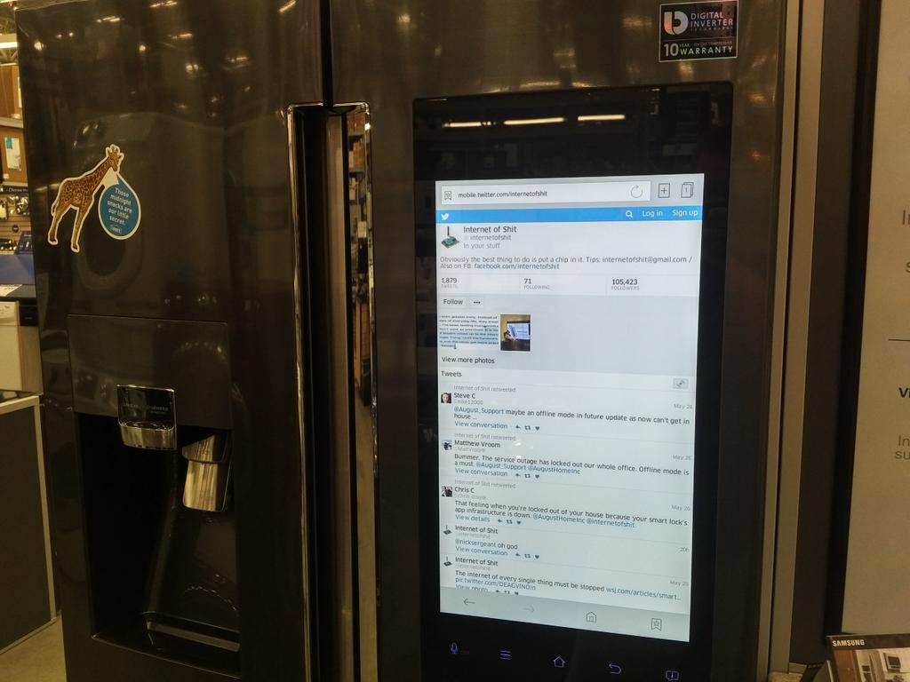
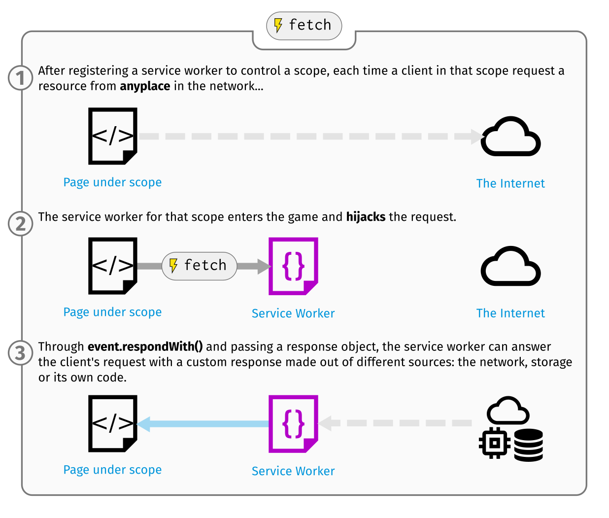
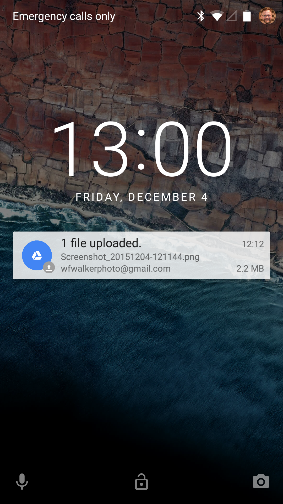
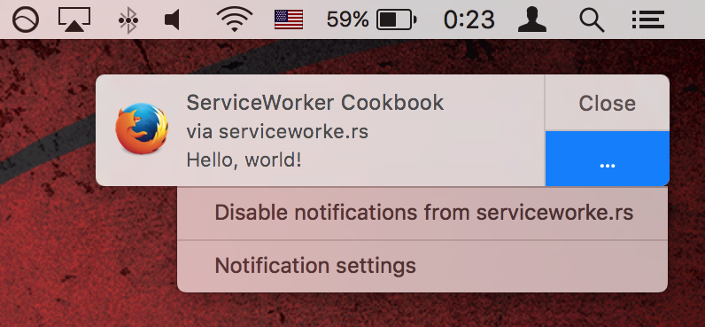
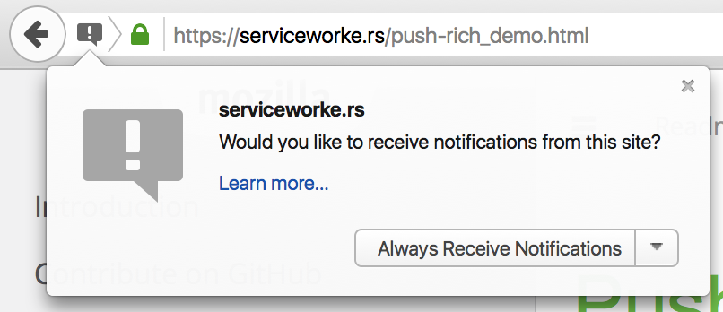

<!-- {{{ Intro -->

```javascript
function hello() {
  // Please sit where you can read this
  console.log("Hello, PyCon!");
}
```

***

# The <span class="fragment fade-out">New<br>Mobile</span> Web

___

## Dan Callahan

## dcallahan@mozilla.com

***

<!-- .slide: data-background="black" -->

 <!-- .element: style="max-width: 75%" -->

<span style="font-size: 1.2rem; position: absolute; right: 0; bottom: 0;">Photo by [@DakotaTheKat](https://twitter.com/dakotathekat/status/736914710185058304)</span>

***

# Only One Web

## Open. Universal. Decentralized.

***

### <em>The Internet is a global public resource that must remain open and accessible.</em>

&mdash;[The Mozilla Manifesto](https://www.mozilla.org/en-US/about/manifesto/)

***

 <!-- .element: style="max-width: 50%" -->

<!-- }}} -->

---

<!-- {{{ Mobile Advantages -->

# Apps vs Web

***

<!-- .slide: data-background="black" -->

 <!-- .element: style="max-width: 50%" -->

***

## Apps won

1. Reliable (Works Offline)
2. Engaging (Notifications)
3. Installable

***

## In 2016, that changes

1. Service Worker
2. Web Push
3. App Manifest

<!-- }}} -->

---

<!-- {{{ ES2015 Syntax + Promises -->

# Before we go on...

## A note on new JavaScript features

***

## Arrow Functions

```javascript
var foo = (x) => x * 2; // <-- New Syntax

var foo = function(x) { return x * 2; }
```

***

## Promises

```javascript
function getData() {
  return fetch('/data').then(foo).then(bar).catch(handle);
  //     ^~~~~~~~~~~~~~ fetch() returns a Promise
}
```

***

## Promises in New Web Features

___

fetch, serviceworker, push, permissions

es2017 async / await

---

<!-- {{{ Reliability -->

# Reliability

## (Offline Support)

***

# Wait a second...

## What are Service Workers?

***

## Service Workers are like script tags, but for domains instead of pages

***

## Service Workers Require SSL

***

 <!-- .element: style="max-width: 50%" -->

***

## Service Worker Registration

```javascript
if ('serviceWorker' in navigator) {
  navigator.serviceWorker.register('/js/sw.js', {scope: '/'})
}
```

***

## Preloading a Cache

```javascript
self.addEventListener('install', function(event) {
  var deps = [ '/', '/style.css', '/app.js', /* ... */ ];

  event.waitUntil(
    caches.open('my-cache-v1')
      .then(cache => cache.addAll(deps));
  );
});
```

***

 <!-- .element: style="max-width: 75%" -->

***

## Responding from a Cache

```javascript
self.addEventListener('fetch', function(event) {
  event.respondWith(
    caches.match(event.request)
      .then(response => response || fetch(event.request))
  );
});
```

***

<!-- {{{ cache-first -->
<div class="diagram-container">
<svg viewBox="0 0 549.92853 265"><g transform="translate(-36.352 -120.593)"><text x="248.603" y="384.105" class="label">ServiceWorker</text><use xlink:href="#diagram-sw" width="549.929" height="342.978" transform="translate(160.325 204.743)"></use><text x="89.548" y="252.972" class="label">Page</text><use transform="translate(-31.309 48.726)" height="342.978" width="549.929" xlink:href="#diagram-page"></use><text x="537.439" y="383.491" class="label">Cache</text><use xlink:href="#diagram-cache" width="549.929" height="342.978" transform="translate(461.439 210.129)"></use><text x="400.625" y="253.272" class="label">Network</text><use transform="translate(317.347 80.91)" height="342.978" width="549.929" xlink:href="#diagram-network"></use><g class="anim sequence"><g class="anim" data-time-padding="0.6" style="display: inline;"><g class="joiner" style="display: inline;"><path d="M125.228 217.424c-.572 41.786 20.007 74.986 60.648 75.56" style="stroke-dasharray: 109.124, 109.124; stroke-dashoffset: 0; transition: stroke-dashoffset 0.727495s ease-in-out 0s;"></path><path d="M177.64 287.113l10.897 5.65-10.857 5.002" style="stroke-dasharray: 24.2285, 24.2285; stroke-dashoffset: 0; transition: stroke-dashoffset 0.161523s ease-in-out 0.827495s;"></path></g><text x="189.791" y="151.852" class="fade-in state-label" transform="translate(-33.772 202.062) translate(0 -90)" style="display: inline; opacity: 1; transition: opacity 0.6s cubic-bezier(0.455, 0.03, 0.515, 0.955) 0s;">1</text></g><g class="anim" data-time-padding="0.6" style="display: inline;"><g class="joiner" style="display: inline;"><path d="M305.727 320.923c63.06 22.954 117.92 22.76 182.588 6.315" style="stroke-dasharray: 185.788, 185.788; stroke-dashoffset: 0; transition: stroke-dashoffset 1.23858s ease-in-out 1.68902s;"></path><path d="M477.033 324.593l15.393 1.14-11.972 9.692" style="stroke-dasharray: 30.8385, 30.8385; stroke-dashoffset: 0; transition: stroke-dashoffset 0.20559s ease-in-out 3.0276s;"></path></g><text x="215.445" y="131.329" class="fade-in state-label" transform="translate(-33.772 202.062) translate(219.43 -3.206)" style="display: inline; opacity: 1; transition: opacity 0.6s cubic-bezier(0.455, 0.03, 0.515, 0.955) 1.68902s;">2</text></g><g class="anim" data-time-padding="0.6" style="display: inline;"><g class="cross" style="display: inline;"><path d="M487.304 315.19l18.813 19.955" style="stroke-dasharray: 27.425, 27.425; stroke-dashoffset: 0; transition: stroke-dashoffset 0.182833s ease-in-out 3.93319s;"></path><path d="M503.267 312.91l-14.252 23.375" style="stroke-dasharray: 27.3772, 27.3772; stroke-dashoffset: 0; transition: stroke-dashoffset 0.182515s ease-in-out 4.21603s;"></path></g></g><g class="anim" data-time-padding="0.6" style="display: inline;"><g class="joiner" style="display: inline;"><path d="M306.297 294.13c41.367 4.712 30.642-61.09 53.737-84.936" style="stroke-dasharray: 108.92, 108.92; stroke-dashoffset: 0; transition: stroke-dashoffset 0.726131s ease-in-out 5.09854s;"></path><path d="M350.672 212.27l10.33-5.536-.98 12.597" style="stroke-dasharray: 24.355, 24.355; stroke-dashoffset: 0; transition: stroke-dashoffset 0.162366s ease-in-out 5.92467s;"></path></g><text class="fade-in state-label" y="93.136" x="140.753" transform="translate(-33.772 202.062) translate(220 -30)" style="display: inline; opacity: 1; transition: opacity 0.6s cubic-bezier(0.455, 0.03, 0.515, 0.955) 5.09854s;">3</text></g><g class="anim" data-time-padding="0.6" style="display: inline;"><g class="joiner" style="display: inline;"><path d="M349.054 172.7c-48.11-26.075-154.585-24.56-198.804-3.377" style="stroke-dasharray: 203.562, 203.562; stroke-dashoffset: 0; transition: stroke-dashoffset 1.35708s ease-in-out 6.78704s;"></path><path d="M156.36 160.117l-9.12 9.69 11.97 1.712" style="stroke-dasharray: 25.3986, 25.3986; stroke-dashoffset: 0; transition: stroke-dashoffset 0.169324s ease-in-out 8.24412s;"></path></g><text x="145.324" y="91.993" class="fade-in state-label" transform="translate(-33.772 202.062) translate(129.355 -98.981)" style="display: inline; opacity: 1; transition: opacity 0.6s cubic-bezier(0.455, 0.03, 0.515, 0.955) 6.78704s;">4</text></g></g></g></svg>
</div>
<!-- }}} -->

<em style="font-size: 1.2rem; position: absolute; right: 0; bottom: 0;">Diagram from [The Offline Cookbook](https://jakearchibald.com/2014/offline-cookbook/)</em>

***

<!-- {{{ network-first -->
<div class="diagram-container">
<svg viewBox="0 0 549.92853 265"><g transform="translate(-36.352 -120.593)"><text x="248.603" y="384.105" class="label">ServiceWorker</text><use xlink:href="#diagram-sw" width="549.929" height="342.978" transform="translate(160.325 204.743)"></use><text x="89.548" y="252.972" class="label">Page</text><use transform="translate(-31.309 48.726)" height="342.978" width="549.929" xlink:href="#diagram-page"></use><text x="537.439" y="383.491" class="label">Network</text><use xlink:href="#diagram-network" width="549.929" height="342.978" transform="translate(455.439 210.129)"></use><text x="400.625" y="253.272" class="label">Cache</text><use transform="translate(323.347 80.91)" height="342.978" width="549.929" xlink:href="#diagram-cache"></use><g class="anim sequence"><g class="anim" data-time-padding="0.6" style="display: inline;"><g class="joiner" style="display: inline;"><path d="M125.228 217.424c-.572 41.786 20.007 74.986 60.648 75.56" style="stroke-dasharray: 109.124, 109.124; stroke-dashoffset: 0; transition: stroke-dashoffset 0.727495s ease-in-out 0s;"></path><path d="M177.64 287.113l10.897 5.65-10.857 5.002" style="stroke-dasharray: 24.2285, 24.2285; stroke-dashoffset: 0; transition: stroke-dashoffset 0.161523s ease-in-out 0.827495s;"></path></g><text x="189.791" y="151.852" class="fade-in state-label" transform="translate(-33.772 202.062) translate(0 -90)" style="display: inline; opacity: 1; transition: opacity 0.6s cubic-bezier(0.455, 0.03, 0.515, 0.955) 0s;">1</text></g><g class="anim" data-time-padding="0.6" style="display: inline;"><g class="joiner" style="display: inline;"><path d="M305.727 320.923c63.06 22.954 117.92 22.76 182.588 6.315" style="stroke-dasharray: 185.788, 185.788; stroke-dashoffset: 0; transition: stroke-dashoffset 1.23858s ease-in-out 1.68902s;"></path><path d="M477.033 324.593l15.393 1.14-11.972 9.692" style="stroke-dasharray: 30.8385, 30.8385; stroke-dashoffset: 0; transition: stroke-dashoffset 0.20559s ease-in-out 3.0276s;"></path></g><text x="215.445" y="131.329" class="fade-in state-label" transform="translate(-33.772 202.062) translate(219.43 -3.206)" style="display: inline; opacity: 1; transition: opacity 0.6s cubic-bezier(0.455, 0.03, 0.515, 0.955) 1.68902s;">2</text></g><g class="anim" data-time-padding="0.6" style="display: inline;"><g class="cross" style="display: inline;"><path d="M487.304 315.19l18.813 19.955" style="stroke-dasharray: 27.425, 27.425; stroke-dashoffset: 0; transition: stroke-dashoffset 0.182833s ease-in-out 3.93319s;"></path><path d="M503.267 312.91l-14.252 23.375" style="stroke-dasharray: 27.3772, 27.3772; stroke-dashoffset: 0; transition: stroke-dashoffset 0.182515s ease-in-out 4.21603s;"></path></g></g><g class="anim" data-time-padding="0.6" style="display: inline;"><g class="joiner" style="display: inline;"><path d="M306.297 294.13c53.367 3.57 53.5-42.803 58.308-70.08" style="stroke-dasharray: 104.613, 104.613; stroke-dashoffset: 0; transition: stroke-dashoffset 0.697418s ease-in-out 5.09854s;"></path><path d="M358.1 231.7l6.902-10.108 3.593 12.025" style="stroke-dasharray: 24.79, 24.79; stroke-dashoffset: 0; transition: stroke-dashoffset 0.165266s ease-in-out 5.89596s;"></path></g><text class="fade-in state-label" y="91.993" x="145.324" transform="translate(-33.772 202.062) translate(220 -30)" style="display: inline; opacity: 1; transition: opacity 0.6s cubic-bezier(0.455, 0.03, 0.515, 0.955) 5.09854s;">3</text></g><g class="anim" data-time-padding="0.6" style="display: inline;"><g class="joiner" style="display: inline;"><path d="M349.054 172.7c-48.11-26.075-154.585-24.56-198.804-3.377" style="stroke-dasharray: 203.562, 203.562; stroke-dashoffset: 0; transition: stroke-dashoffset 1.35708s ease-in-out 6.76123s;"></path><path d="M156.36 160.117l-9.12 9.69 11.97 1.712" style="stroke-dasharray: 25.3986, 25.3986; stroke-dashoffset: 0; transition: stroke-dashoffset 0.169324s ease-in-out 8.21831s;"></path></g><text x="145.324" y="91.993" class="fade-in state-label" transform="translate(-33.772 202.062) translate(129.355 -98.981)" style="display: inline; opacity: 1; transition: opacity 0.6s cubic-bezier(0.455, 0.03, 0.515, 0.955) 6.76123s;">4</text></g></g></g></svg>
</div>
<!-- }}} -->

<em style="font-size: 1.2rem; position: absolute; right: 0; bottom: 0;">Diagram from [The Offline Cookbook](https://jakearchibald.com/2014/offline-cookbook/)</em>

***

<!-- {{{ stale-while-revalidate -->
<div class="diagram-container">
<svg viewBox="0 0 549.92853 265"><g transform="translate(-36.352 -120.593)"><text x="248.603" y="384.105" class="label">ServiceWorker</text><use xlink:href="#diagram-sw" width="549.929" height="342.978" transform="translate(160.325 204.743)"></use><text x="89.548" y="252.972" class="label">Page</text><use transform="translate(-31.309 48.726)" height="342.978" width="549.929" xlink:href="#diagram-page"></use><text x="537.439" y="383.491" class="label">Network</text><use xlink:href="#diagram-network" width="549.929" height="342.978" transform="translate(455.439 210.129)"></use><text x="400.625" y="253.272" class="label">Cache</text><use transform="translate(323.347 80.91)" height="342.978" width="549.929" xlink:href="#diagram-cache"></use><g class="anim sequence"><g class="anim" data-time-padding="0.6" style="display: inline;"><g class="joiner" style="display: inline;"><path d="M125.228 217.424c-.572 41.786 20.007 74.986 60.648 75.56" style="stroke-dasharray: 109.124, 109.124; stroke-dashoffset: 0; transition: stroke-dashoffset 0.727495s ease-in-out 0s;"></path><path d="M177.64 287.113l10.897 5.65-10.857 5.002" style="stroke-dasharray: 24.2285, 24.2285; stroke-dashoffset: 0; transition: stroke-dashoffset 0.161523s ease-in-out 0.827495s;"></path></g><text x="189.791" y="151.852" class="fade-in state-label" transform="translate(-33.772 202.062) translate(0 -90)" style="display: inline; opacity: 1; transition: opacity 0.6s cubic-bezier(0.455, 0.03, 0.515, 0.955) 0s;">1</text></g><g class="anim" data-time-padding="0.6" style="display: inline;"><g class="joiner" style="display: inline;"><path d="M306.297 294.13c53.367 3.57 53.5-42.803 58.308-70.08" style="stroke-dasharray: 104.613, 104.613; stroke-dashoffset: 0; transition: stroke-dashoffset 0.697418s ease-in-out 1.68902s;"></path><path d="M358.1 231.7l6.902-10.108 3.593 12.025" style="stroke-dasharray: 24.79, 24.79; stroke-dashoffset: 0; transition: stroke-dashoffset 0.165266s ease-in-out 2.48644s;"></path></g><text class="fade-in state-label" y="91.993" x="145.324" transform="translate(-33.772 202.062) translate(220 -30)" style="display: inline; opacity: 1; transition: opacity 0.6s cubic-bezier(0.455, 0.03, 0.515, 0.955) 1.68902s;">2</text></g><g class="anim" data-time-padding="0.6" style="display: inline;"><g class="joiner" style="display: inline;"><path d="M349.054 172.7c-48.11-26.075-154.585-24.56-198.804-3.377" style="stroke-dasharray: 203.562, 203.562; stroke-dashoffset: 0; transition: stroke-dashoffset 1.35708s ease-in-out 3.3517s;"></path><path d="M156.36 160.117l-9.12 9.69 11.97 1.712" style="stroke-dasharray: 25.3986, 25.3986; stroke-dashoffset: 0; transition: stroke-dashoffset 0.169324s ease-in-out 4.80878s;"></path></g><text x="145.324" y="91.993" class="fade-in state-label" transform="translate(-33.772 202.062) translate(129.355 -98.981)" style="display: inline; opacity: 1; transition: opacity 0.6s cubic-bezier(0.455, 0.03, 0.515, 0.955) 3.3517s;">3</text></g><g class="anim" data-time-padding="0.6" style="display: inline;"><g class="joiner" style="display: inline;"><path d="M305.727 320.923c63.06 22.954 117.92 22.76 182.588 6.315" style="stroke-dasharray: 185.788, 185.788; stroke-dashoffset: 0; transition: stroke-dashoffset 1.23858s ease-in-out 5.67811s;"></path><path d="M477.033 324.593l15.393 1.14-11.972 9.692" style="stroke-dasharray: 30.8385, 30.8385; stroke-dashoffset: 0; transition: stroke-dashoffset 0.20559s ease-in-out 7.01669s;"></path></g><text x="215.445" y="131.329" class="fade-in state-label" transform="translate(-33.772 202.062) translate(219.43 -3.206)" style="display: inline; opacity: 1; transition: opacity 0.6s cubic-bezier(0.455, 0.03, 0.515, 0.955) 5.67811s;">4</text></g><g class="anim" data-time-padding="0.6" style="display: inline;"><g class="joiner" style="display: inline;"><path d="M534.613 243.64c-1.14-30.785-30.215-70.12-83.804-70.69" style="stroke-dasharray: 120.667, 120.667; stroke-dashoffset: 0; transition: stroke-dashoffset 0.804447s ease-in-out 7.92228s;"></path><path d="M459.93 167.248l-11.4 6.27 11.4 5.132" style="stroke-dasharray: 25.5124, 25.5124; stroke-dashoffset: 0; transition: stroke-dashoffset 0.170083s ease-in-out 8.82673s;"></path></g><text class="fade-in state-label" y="149.572" x="215.445" transform="translate(-33.772 202.062) translate(312.925 -130.336)" style="display: inline; opacity: 1; transition: opacity 0.6s cubic-bezier(0.455, 0.03, 0.515, 0.955) 7.92228s;">5</text></g></g></g></svg>
</div>
<!-- }}} -->

<em style="font-size: 1.2rem; position: absolute; right: 0; bottom: 0;">Diagram from [The Offline Cookbook](https://jakearchibald.com/2014/offline-cookbook/)</em>

***

<!-- .slide: data-background="black" -->

<video controls class="stretch" src="img/pokedex.mp4"></video>

<!-- }}} -->

---

<!-- {{{ Engagement -->

# Engagement

## (Push Notifications)

***

<!-- .slide: data-background="black" -->

 <!-- .element: style="max-width: 50%; max-height: 75vh;" -->

***

<!-- .slide: data-background="black" -->

 <!-- .element: style="max-width: 50%; max-height: 75vh" -->

***

## Receiving Push Events

```javascript
self.addEventListener('push', function(event) {
  event.waitUntil(
    self.registration.showNotification('My Title', {
      body: 'Hello, world!'
    })
  );
});
```

***

<!-- .slide: data-background="black" -->

 <!-- .element: style="max-width: 50%" -->

***

<!-- .slide: data-background="black" -->

 <!-- .element: style="max-width: 50%" -->

***

## Getting Permission

```javascript
navigator.serviceWorker.ready
  .then(registration => registration.pushManager.subscribe())
  .then(subscription => fetch('/api/save-endpoint', {
    method: 'POST',
    headers: { 'Content-Type: application/json' },
    body: JSON.stringify(subscription)
  }))
  .then(res => ...);
```

<!-- }}} -->

---

<!-- {{{ Installation -->

# Installation

***

## App Manifests

***

```html
<link rel="manifest" src="/manifest.json">
```

```javascript
{
  "name": "Flipkart Lite",
  "short_name": "Flipkart Lite",
  "icons": [{
    "src": "https://img1a.flixcart.com/logo.png",
    "sizes": "192x192", "type": "image/png"
  }],
  "start_url": "/",
  "orientation": "portrait",
  "display": "standalone",
  "theme_color": "#006cb4",
  "background_color": "#006cb4"
}
```

***

<!-- .slide: data-background="black" -->

<video controls class="stretch" src="img/flipkart.mp4"></video>

<!-- }}} -->

---

<!-- {{{ Conclusion -->

# The Web Can Be

## Installable, Reliable, and Engaging

___

### Open, Universal, and Compatible

***

# Questions?

Slides and links at [github.com/callahad/pycon-newweb](https://github.com/callahad/pycon-newweb)

<!-- }}} -->

<!-- vim: set foldmethod=marker foldenable foldcolumn=1: -->
