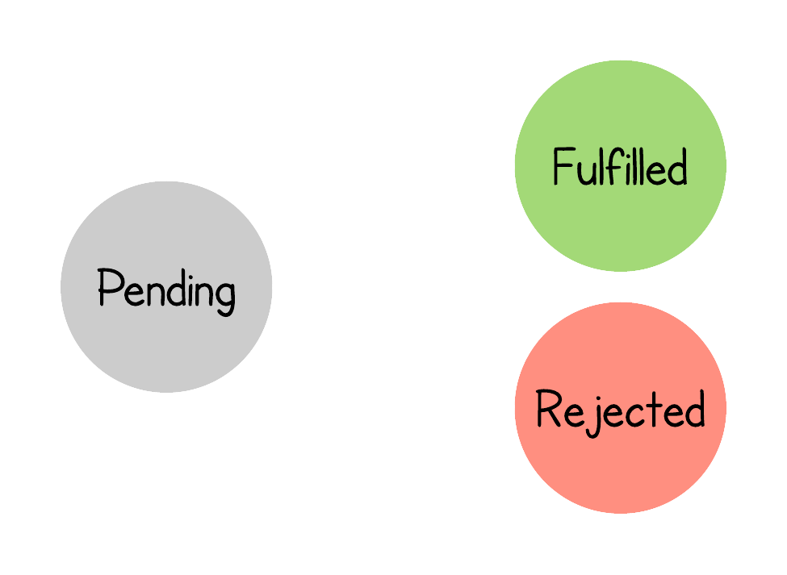
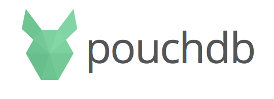
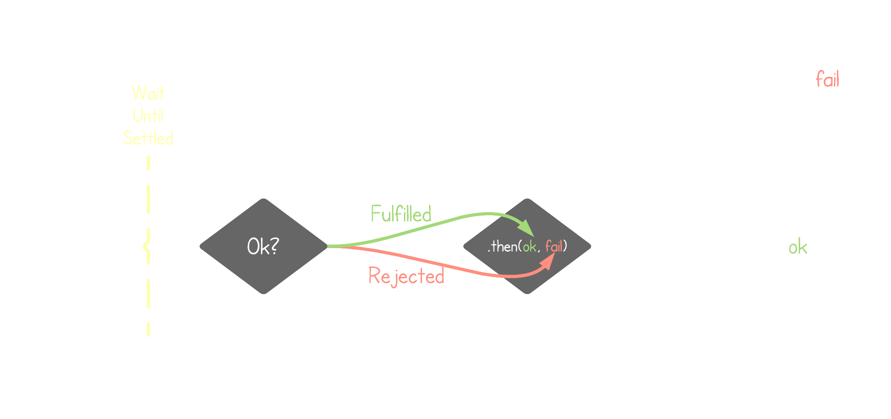

# Mastering Asynchronous JavaScript

## Dan Callahan · @callahad

## dcallahan@mozilla.com

---

## Arrow Functions

```javascript
var foo = (x) => x * 2; // <-- New ES6 Syntax

var foo = function(x) { return x * 2; }
```

---

## Express.js Server

```javascript
app.get('/', function (req, res) {
  res.send('Hello, world!');
});

app.get('/foo', function (req, res) {
  var data = fs.readFileSync(FILE_PATH, 'utf-8');
  res.send('Read ' + data.length + ' bytes');
});
```

---

# DEMO

(blocking i/o)

---

## JavaScript is Single-Threaded

---

<!-- .slide: data-background="black" -->


---

## Blocking

```javascript
app.get('/foo', function (req, res) {
  var data = fs.readFileSync(FILE_PATH, 'utf-8');
  res.send('Read ' + data.length + ' bytes');
});
```

## Non-Blocking

```javascript
app.get('/bar', function (req, res) {
  fs.readFile(FILE_PATH, 'utf-8', function(err, data) {
    res.send('Read ' + data.length + ' bytes');
  });
});
```

---

# DEMO

(non-blocking i/o)

---

## Control flow becomes a dynamic side-effect of running code

---

## Async Conventions

```javascript
// Node-style Callbacks
request.get("/foo", function (err, result) { ... })

// jQuery Deferreds
$.get("/foo").done(callback).fail(callback).always(callback)....

// CommonJS Promises/A+
fetch("/foo").then(ok, fail).then(ok, fail)....

// Abusing Generators to Implement Coroutines
// ...let's just ignore this one
```

---

## ECMAScript 2015 ("ES6") Standardized on Promises

---

<!-- .slide: data-background="black" -->

 <!-- .element: style="max-width: 50%" -->

---

# DEMO

(localforage)

---



---

## .then(ok, fail)

```javascript
p.then(ok, fail)             // Handle both
p.then(ok, undefined)        // Pass through rejections
p.then(undefined, fail)      // Pass through fulfillments
p.then(undefined, undefined) // Pass through both
```

## .catch(fail)

```javascript
p.then(ok).catch(fail)                                    /*
          ^~~~~~~~~~~~ Alias for .then(undefined, fail)   */
```

---

## Promise Chaining

```javascript
function foo() {
  return fetch().then(stepOne).then(stepTwo).catch(handleErr);
  //     ^~~~~~~ Returns a Promise
}

foo().then(stepThree);
//         ^~~~~~~~~ Wont't run until entire chain settles
```

---

<!-- .slide: data-background="black" -->



---

## Promise Constructors

```javascript
new Promise(function(resolve, reject) { /* ... */ });

Promise.resolve(42);

Promise.reject("Bah, humbug!");
```

---

## Promisification by hand

```javascript
function readFilePromise = function(filename, encoding) {
  return new Promise(function(resolve, reject) {
    fs.readFile(filename, encoding, function(err, data) {
      if (err) {
        reject(err);
      } else {
        resolve(data);
      }
    });
  });
}

app.get('/baz', function (req, res) {
  fs.readFilePromise(FILE_PATH, 'utf-8')
  .then(data => res.send('Read ' + data.length + ' bytes'))
});
```

---

## Promisification with a library

```javascript
// Example using Bluebird from http://bluebirdjs.com/
var readFilePromise = bluebird.promisify(fs.readfile);
var pfs = bluebird.promisifyAll(fs);

app.get('/baz', function (req, res) {
  fs.readFilePromise(FILE_PATH, 'utf-8')
  .then(data => res.send('Read ' + data.length + ' bytes'))
});
```

---

## ES6 Utilities

```javascript
Promise.all([p1, p2, ..., pN]).then(allResults => { ... });

Promise.race([p1, p2, ..., pN]).then(firstResult => { ...  });
```

---

> "Refactor of PouchDB's map/reduce module to replace callbacks with promises: 290 insertions, 555 deletions."

---

## Supported Everywhere but IE

Easy to polyfill

---

## Used in the Web Platform

fetch, serviceworker, push

---

## Unsubscribing from Push

```javascript
navigator.serviceWorker.ready
.then(reg => reg.pushManager.getSubscription())
.then(subscription => subscription.unsubscribe())
.then(successful => /* if successful === true, unsubscribed... */ )
.catch(err => /* Unsubscription failed */) 
```

---

# PUZZLES

---

## Puzzle #1

```javascript
Promise.resolve("foo").then().then().then(x => console.log(x));
```

---

## Puzzle #2

```javascript
Promise.resolve("foo")
       .then("bar")
       .then(x => console.log(x));
```

---

## Puzzle #3

```javascript
Promise.resolve("foo")
       .then(Promise.resolve("bar"))
       .then(x => console.log(x));
```

---

## Puzzle #4

```javascript
var p = Promise.resolve({});

p.then(x => x["hello"] = "world");

p.then(x => console.log(x));
```

---

## Puzzle #5
```javascript
function f() {
  return Promise.resolve("foo")
                .then(a => { return "bar" })
                .then(b => { return a + b })
}

f().then(x => console.log(x))
   .catch(err => console.error("Caught:", err));
```

---

## Forwarding values

```javascript
function f() {
  return Promise.resolve("foo")
                .then(a => { return Promise.all([a, "bar"]) })
                .then(b => { return b[0] + b[1] })
}

f().then(x => console.log(x))
   .catch(err => console.error("Caught:", err));
```

---

## ES7 async / await

```javascript
async function f() {
  try {
    var a = await Promise.resolve("foo");
    var b = await Promise.resolve("bar");
    var x = a + b;
    return x;
  } catch(err) {
    throw err;
  }
}

f().then(x => console.log(x))
   .catch(err => console.error("Caught:", err));
```

---

## BabelJS.io

---

 <!-- .element: style="max-width: 50%" -->

---

# Questions?

@callahad

Slides at https://github.com/callahad/tccc19-async
